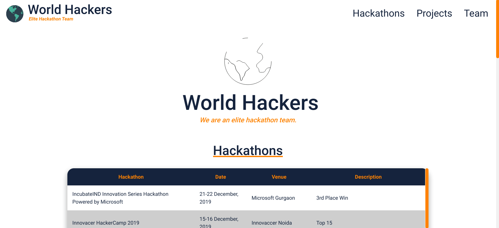

<h1 align="center">
  
</h1>

<h3 align="center">
  <i>
   A website created for World-Hackers Hackathon
  </i>
</h3>

<p align="center">
  
  
  
  
  
  
</p>

<hr>

## ✨ In Action

<p align="center">
  
</p>

## 💻 Try it out

```sh
git clone https://github.com/rgbhack/worldhackers-website.git
Run index.html in public folder
```

## 👨‍💻 Authors

**Aadit Gupta, Raadwan Masum, Rohan Juneja, and Safin Singh**

## 🤝 Contributing

Contributions, PRs, issues and feature requests are welcome! Feel free to check out my [issues page](https://github.com/RGBHack/worldhackers-website/issues).

## ❤️ Show your support

Give a ⭐️ if this project helped you!
Hope you enjoy it!
